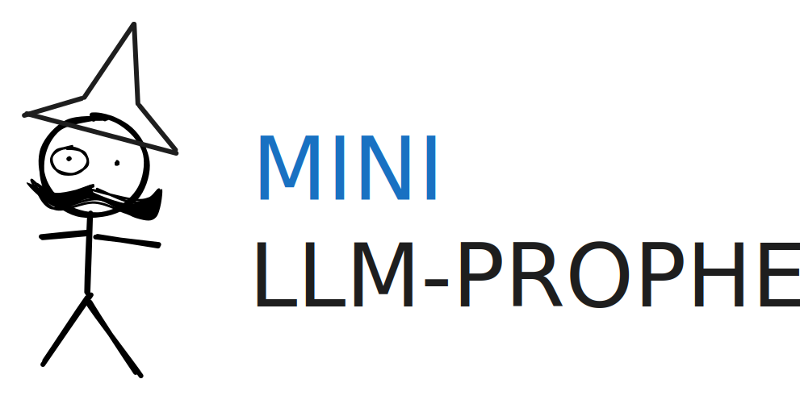
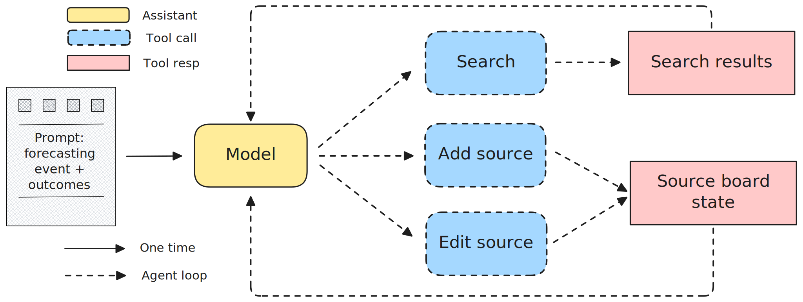

<p align="center">
  
</p>

# mini-prophet

A minimal LLM forecasting agent scaffolding. Inspired by [mini-swe-agent](https://github.com/SWE-agent/mini-swe-agent).

<p align="left">
  
</p>

## Install

```bash
cd mini-prophet
pip install -e ".[perplexity]"
```

`perplexity` is the default search backend, so this is the recommended install.
If you only use Brave search, `pip install -e .` is enough.
If you want Exa search, use `pip install -e ".[exa]"`.

## Set API keys

Use the built-in CLI to persist keys into prophet's global `.env` file:

```bash
# Step 1: search API keys (one of the below is good)
prophet set PERPLEXITY_API_KEY "your-perplexity-key"
prophet set BRAVE_API_KEY "your-brave-key"
prophet set EXA_API_KEY "your-exa-key"

# Step 2: model API key (if you use OpenRouter, this works with any model)
prophet set OPENROUTER_API_KEY "your-openrouter-key"

# Or you go with LiteLLM (--model-class litellm), set model-specific API keys
# For instance, if you want to use OpenAI models
prophet set OPENAI_API_KEY "your-openai-key"

# interactive editor can do the same!
prophet set -i
```

By default, prophet stores and loads values from:

- `~/.config/mini-prophet/.env` (in linux; or your platform's equivalent config directory)

To use a different global config directory, set:

```bash
export MINIPROPHET_GLOBAL_CONFIG_DIR="/path/to/custom/config-dir"
```

You can still set environment variables directly in your shell if you prefer.

## Try this

Single run:

```bash
prophet run \
  --title "Which team will win the NBA championship in 2026?" \
  --outcomes "Bucks,Warriors,Celtics,Nuggets,Other" \
  --model-class litellm \
  --model gemini/gemini-3-flash-preview
```

Interactive mode:

```bash
prophet run -i --model-class litellm --model gemini/gemini-3-flash-preview
```

Eval mode with the sample file:

```bash
prophet eval \
  -f examples/example_batch_job.jsonl \
  -o outputs/eval-demo \
  -w 4 \
  --model-class litellm \
  --model gemini/gemini-3-flash-preview
```

Resume an interrupted eval run and skip completed run IDs:

```bash
prophet eval -f examples/example_batch_job.jsonl -o outputs/eval-demo --resume
```

Run eval directly from a standardized dataset:

```bash
prophet eval -d weekly-nba@latest -o outputs/weekly-nba
```

List and validate datasets:

```bash
prophet datasets list
prophet datasets validate -f examples/example_batch_job.jsonl
```

Run artifacts now include `sources.json` in addition to `info.json` and `trajectory.json`.

## Contributing

Contributor-facing testing and CI notes live in [CONTRIBUTOR.md](CONTRIBUTOR.md).

## Docs

Detailed docs are split by topic:

- [Architecture](docs/architecture.md)
- [CLI (single run)](docs/cli.md)
- [Eval processing](docs/eval.md)
- [Dataset management](docs/datasets.md)
- [Extending the framework](docs/extension.md)
- [Output and trajectory format](docs/output.md)

Release notes: [CHANGLOG.md](CHANGLOG.md)
