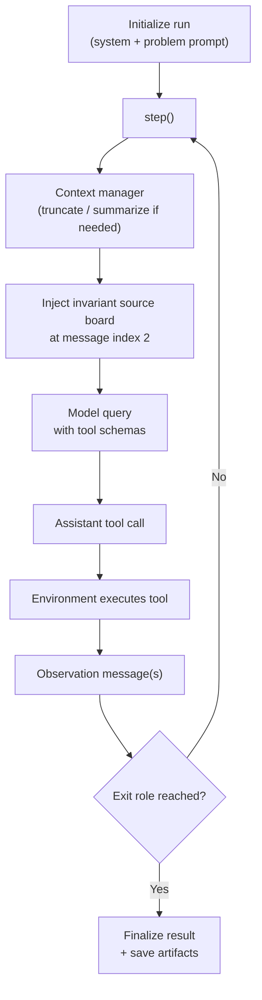

# Architecture

This page explains the core agent loop and how state flows through the system.

## Core idea

`mini-llm-prophet` runs a one-action-per-step tool loop:

1. Build the current message context.
2. Ask the model for exactly one tool call.
3. Execute the tool in the environment.
4. Feed the observation back to the model.
5. Repeat until `submit` (or limits/exit).

## Agent loop

## Invariant context organization

By default, each step rebuilds context in a stable order:

- `messages[0]`: system prompt
- `messages[1]`: instance/user forecast prompt
- `messages[2]`: source board snapshot (injected every step)
- remaining: rolling conversation/tool observations

Important details:

- Stale board messages are removed before context management.
- Context manager runs before board reinjection.
- The board is always reinserted, so the model sees a fresh invariant board state each step.

## Default context manager

`SlidingWindowContextManager` keeps the first two messages fixed, truncates older body messages, and injects a synthetic truncation notice with past query history.

That gives two guarantees:

- Stable task framing is preserved.
- Query history survives truncation, reducing duplicate searches.

## Environment and tools

`ForecastEnvironment` is a thin dispatcher:

- parses tool-call JSON args
- routes by tool name
- merges runtime kwargs (for example date filters)
- returns tool output as observation payload

Default tool set:

- `search`
- `add_source`
- `edit_note`
- `submit`

## Runtime filters path

Runtime kwargs supplied to `agent.run(...)` are passed through:

- `DefaultForecastAgent.execute_actions(...)`
- `ForecastEnvironment.execute(...)`
- tool `execute(...)`
- backend searcher `search(..., **kwargs)`

This is how run-level date bounds reach backend-specific search filters.

## Key components

- `DefaultForecastAgent`: core loop, limits, serialization
- `CliForecastAgent`: CLI display hooks
- `BatchForecastAgent`: batch progress + rate-limit coordination
- `ForecastEnvironment`: tool dispatcher
- `SourceBoard`: invariant evidence state
- `TrajectoryRecorder`: per-step replayable trace
