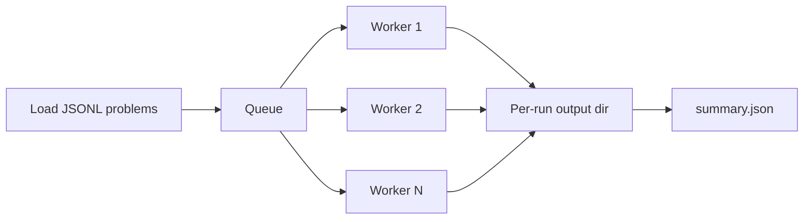

# Batch Processing

This page covers `prophet batch` for running many forecasting jobs from a JSONL file.

## CLI entrypoint

```bash
prophet batch -f <input.jsonl> -o <output_dir> [options]
```

### Options

| Flag | Short | Description |
| --- | --- | --- |
| `--input` | `-f` | Input `.jsonl` file (required) |
| `--output` | `-o` | Output meta-directory (required) |
| `--workers` | `-w` | Parallel worker count (default `1`) |
| `--max-cost` |  | Total batch budget, USD (`0` = unlimited) |
| `--max-cost-per-run` |  | Per-run cost cap (overrides agent config) |
| `--model` | `-m` | Model override |
| `--model-class` |  | Model class override |
| `--config` | `-c` | Config file(s) or `key=value` overrides |

## Try it with the example file

```bash
prophet batch \
  -f examples/example_batch_job.jsonl \
  -o outputs/batch-demo \
  -w 4 \
  --model-class litellm \
  --model gemini/gemini-3-flash-preview
```

## Input format (one JSON object per line)

Required fields:

- `title` (string)
- `outcomes` (array of strings)

Optional fields:

- `run_id` (string): unique id for this run (auto-generated as `run_<n>` if omitted)
- `ground_truth` (object): used for evaluation metrics
- `end_time` (string): parsed and forwarded as search upper-bound date (`search_date_before`)

Example line:

```json
{"title": "Will X happen?", "outcomes": ["Yes", "No"], "run_id": "x-forecast", "end_time": "2026-03-01T00:00:00Z", "ground_truth": {"Yes": 1, "No": 0}}
```

Validation behavior:

- invalid JSON raises an error with line number
- missing `title`/`outcomes` fails validation
- duplicate `run_id` fails validation

## Execution model



Operational details:

- workers consume jobs from a shared queue
- rate-limit errors can be retried (up to max retries)
- global max cost can stop later runs (`skipped_cost_limit`)
- each run still writes `info.json` + `trajectory.json`

## Output layout

Given `-o outputs/batch-demo`:

- `outputs/batch-demo/summary.json`
- `outputs/batch-demo/runs/<run_id>/info.json`
- `outputs/batch-demo/runs/<run_id>/trajectory.json`

`summary.json` includes status, costs, submission/evaluation, and output path per run.
