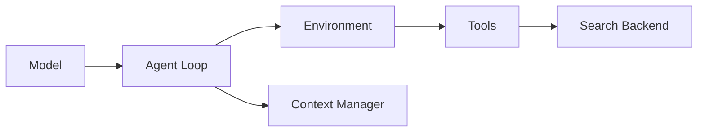

# Extending mini-llm-prophet

This page covers extension points: search backends, tools, models, and context managers.

## Overview



Main extension interfaces are Protocol-based and live in `src/miniprophet/__init__.py`.

## 1. Custom search backend

Implement the `SearchTool` protocol (`search`, `serialize`).

```python
from miniprophet.environment.source_board import Source
from miniprophet.search import SearchResult

class MySearchTool:
    # Optional: override search tool schema shown to the model
    search_parameters_schema = {
        "type": "object",
        "properties": {
            "query": {"type": "string"},
            "since": {"type": "string"},
        },
        "required": ["query"],
    }

    def search(self, query: str, limit: int = 5, **kwargs) -> SearchResult:
        sources = [
            Source(url="https://example.com", title="Example", snippet="...", date="2026-01-01")
        ]
        return SearchResult(sources=sources, cost=0.0)

    def serialize(self) -> dict:
        return {"info": {"config": {"search": {"search_class": "my_search"}}}}
```

### Registering your backend

Two common approaches:

- add it to `_SEARCH_CLASS_MAPPING` in `src/miniprophet/search/__init__.py`
- or pass a fully-qualified class path via config `search.search_class=<module.ClassName>`

Current search config shape supports nested backend config:

```yaml
search:
  search_class: my_search
  my_search:
    timeout: 10
```

## 2. Custom tool

A tool must implement:

- `name`
- `get_schema()`
- `execute(args)`
- `display(output)`

```python
class MyTool:
    @property
    def name(self) -> str:
        return "my_tool"

    def get_schema(self) -> dict:
        return {
            "type": "function",
            "function": {
                "name": "my_tool",
                "description": "Do custom work",
                "parameters": {
                    "type": "object",
                    "properties": {"x": {"type": "string"}},
                    "required": ["x"],
                },
            },
        }

    def execute(self, args: dict) -> dict:
        return {"output": f"ok: {args['x']}"}

    def display(self, output: dict) -> None:
        pass
```

Then construct `ForecastEnvironment(tools=[...])` with your tool list.

## 3. Custom context manager

Context managers shape what the model sees each step.

Required methods:

- `manage(messages, *, step, **kwargs) -> list[dict]`
- `display() -> None`

Optional method used by the default agent:

- `record_query(query: str)`

```python
class MyContextManager:
    def manage(self, messages: list[dict], *, step: int, **kwargs) -> list[dict]:
        return messages

    def display(self) -> None:
        pass
```

Pass it into the agent constructor as `context_manager=...`.

## 4. Custom model

Implement the `Model` protocol (`query`, message formatting helpers, `serialize`).

In practice, the easiest route is using `LitellmModel` with `--model-class litellm`.

## 5. Runtime kwargs pattern

If your backend/tool needs run-scoped knobs, rely on runtime kwargs flow:

- call `agent.run(..., my_arg=...)`
- kwargs propagate through environment to tool/backend execute/search methods

This is how built-in date filters are currently injected.
