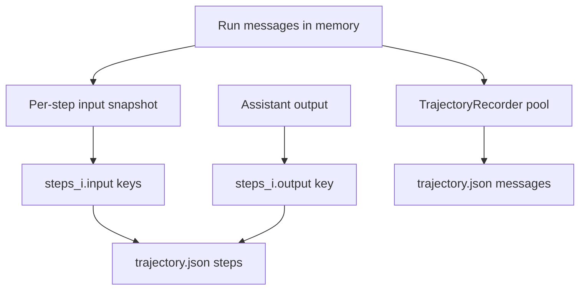

# Output and Trajectory

This page describes what gets saved and how to reconstruct full run history.

## What is saved

When output is enabled (`--output` for single run, or batch run directories), each run writes:

- `info.json`
- `trajectory.json`

`DefaultForecastAgent.save(...)` writes both files, and is called in a `finally` block during run steps, so artifacts stay up to date as the run progresses.

## `info.json`

Contains run metadata such as:

- agent/model/environment config snapshots
- cost stats (`model_cost`, `search_cost`, totals, call counts)
- exit status
- submission
- evaluation (if ground truth provided)
- serialized source board

## `trajectory.json`

Contains replay-oriented trace data from `TrajectoryRecorder`:

- `messages`: global pool of messages with stable keys
- `steps`: per-step input message keys and output key
- `trajectory_format`: version tag

Role-prefixed keys improve readability:

- `S*` system
- `U*` user
- `A*` assistant
- `T*` tool
- `O*` other

## Data model



## Why this is useful

Because each step stores exact input keys, you can reconstruct exactly what the model saw at any step, even when context truncation or synthetic notices were inserted.

## Reconstruct a step quickly

Python snippet:

```python
import json
from pathlib import Path

traj = json.loads(Path("outputs/my-run/trajectory.json").read_text())
index = {m["key"]: m["message"] for m in traj["messages"]}

step = traj["steps"][0]
input_messages = [index[k] for k in step["input"]]
output_message = index[step["output"]]

print("Input roles:", [m["role"] for m in input_messages])
print("Output role:", output_message["role"])
```

## Batch output layout

For batch output directory `<out>`:

- `<out>/summary.json`
- `<out>/runs/<run_id>/info.json`
- `<out>/runs/<run_id>/trajectory.json`

Use `summary.json` to find failed/submitted runs, then open each run's trajectory for detailed debugging.
